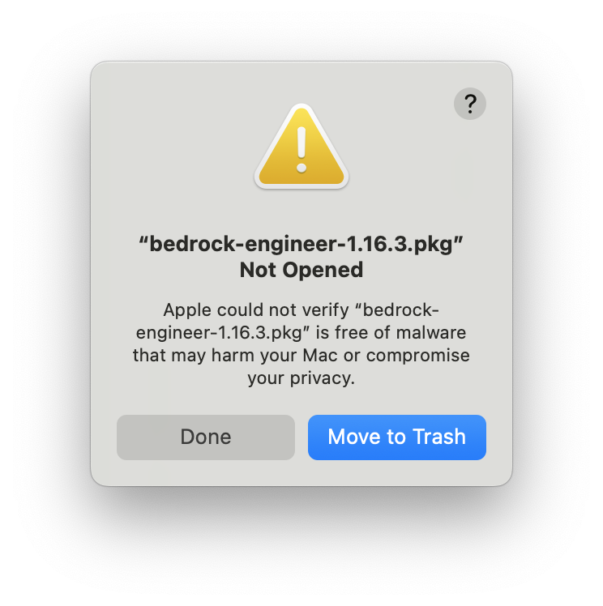
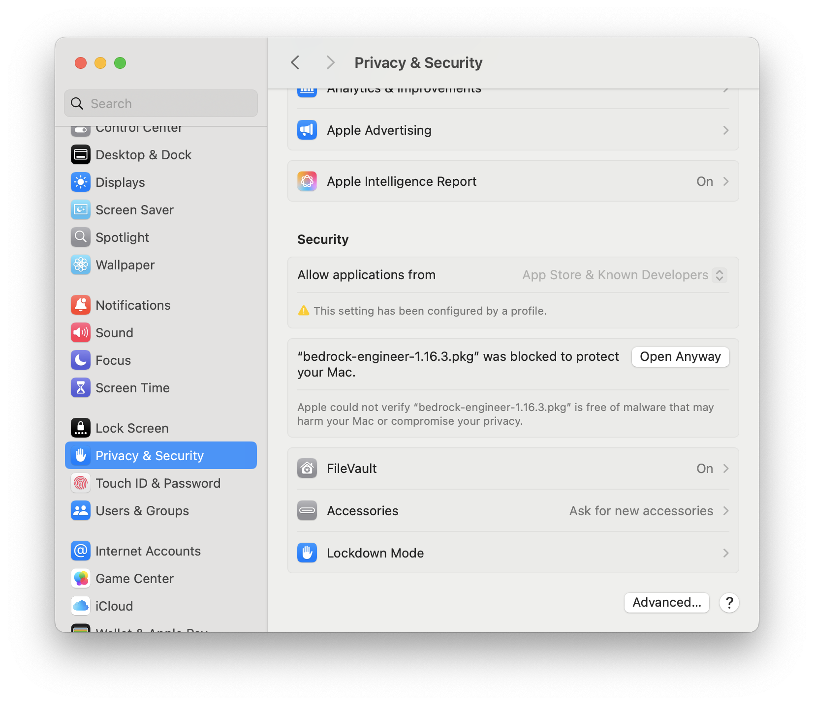
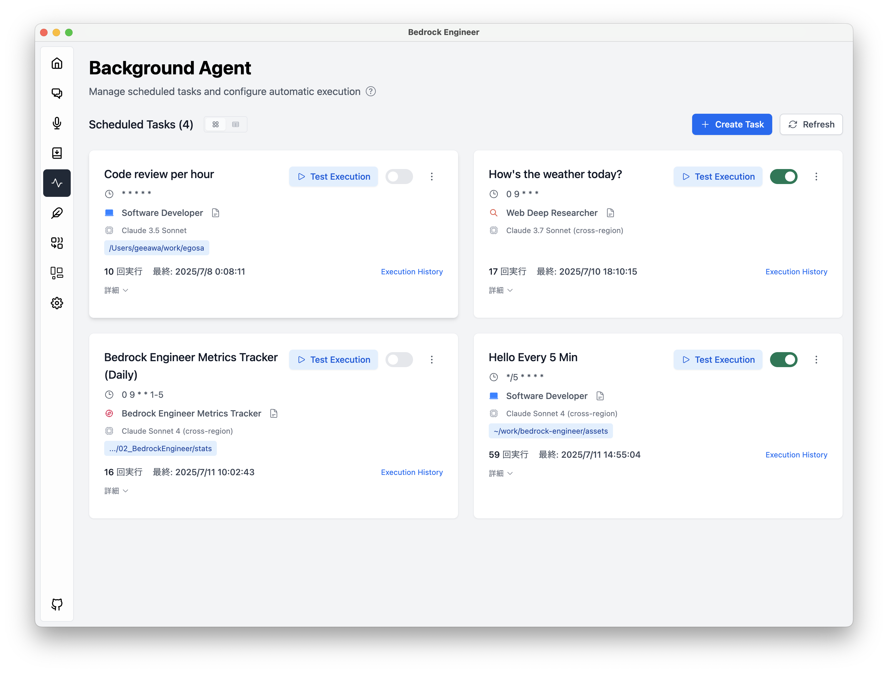

Language: [English](./README.md) / [Japanese](./README-ja.md)

> **ドキュメントの言語ポリシー** — メンテナンス情報の正式版は英語版 README です。翻訳を追加する際は文書全体を対象言語へローカライズし、英語版との内容差分がないか確認してください。

> [!IMPORTANT]

# 🧙 Bedrock Engineer

Bedrock Engineer は、[Amazon Bedrock](https://aws.amazon.com/bedrock/) を活用したソフトウェア開発タスクのための AI アシスタントです。大規模な言語モデルと実際のファイルシステム操作、Web検索機能などを含む自律的な AI エージェントがあなたの開発を支援します。

## 💻 デモ

https://github.com/user-attachments/assets/f6ed028d-f3c3-4e2c-afff-de2dd9444759

## Deck

- [English](https://speakerdeck.com/gawa/introducing-bedrock-engineer-en)
- [Japanese](https://speakerdeck.com/gawa/introducing-bedrock-engineer)

## 🍎 はじめに

Bedrock Engineer はネイティブアプリです。アプリをダウンロードするか、ソースコードをビルドして使用してください。

### Download

MacOS:

[](https://github.com/aws-samples/bedrock-engineer/releases/latest/download/bedrock-engineer-1.19.1.pkg)

Windows:

[](https://github.com/aws-samples/bedrock-engineer/releases/latest/download/bedrock-engineer-1.19.1-setup.exe)

MacOS に最適化されていますが、Windows, Linux OS でもビルドして使用できます。不具合がある場合、issue に起票ください。

> **2025年10月のセキュリティアップデート** — コマンド実行には次の強化された既定値が適用されます。
>
> - `maxConcurrentProcesses`: 同時に起動できるプロセス数を制限します（既定値は `2`。`0` を指定すると上限を無効化できます）。
> - `maxStdinBytes`: 過大な標準入力ペイロードを遮断します（既定値は `65536` バイト、上限は `262144` バイト）。
> - `passthroughEnvKeys`: サブプロセスに引き継ぐ環境変数の許可リストです（大文字の `[A-Z0-9_]` のみが有効）。
> - `additionalPathEntries`: `commandSearchPaths` 設定を介してマスクされた `PATH` を安全に拡張します。
>
> これらの値は **設定 → 詳細設定 → コマンド実行** から、または暗号化ストアの `commandMaxConcurrentProcesses`、`commandMaxStdinBytes`、`commandPassthroughEnvKeys`、`commandSearchPaths` キーを編集して調整できます。

> **2025年10月のログ更新** — 警告・エラーログのメタデータから動的な値が自動的にマスクされるようになりました。メッセージ本文は固定文言のままにし、必要なコンテキストはメタデータ（`[USER_ID]` のようなプレースホルダーを含む）として渡してください。詳しくは [Logging Hygiene and Redaction Policy](./docs/logging.md) を参照してください。

#### 2025年10月のメンテナンスノート

- ESLint は Flat Config に対応した `typescript-eslint` バンドルを使用するようになりました。`npm run lint` を実行する前に `npm ci`（または `npm install`）を実行して依存関係を更新してください。ラッパースクリプトは workspace 直下とネストした `node_modules` の両方からバンドル本体・parser・plugin を解決し、いずれかが欠けている場合は再インストールを促すメッセージを出して終了します。
- TypeScript のツールチェーンは TypeScript 5.9.x と `@types/node@22.18.x` を対象としています。5.9 の新機能や Node 22 の型が見つからないというコンパイラエラーが出た場合は、一度 `node_modules` を削除してから `npm ci` を再実行してください。
- TypeScript の型チェックコマンドは `scripts/run-tsc.mjs` を経由して実行されます。`typescript` の存在に加え、指定した tsconfig が `extends` で参照する設定ファイルと `references.path` で指定したプロジェクト参照がすべて解決できるか事前に検証し、欠けている場合は静的なリカバリーメッセージを表示して終了します。警告が表示された際は `npm ci`（または不足している設定ファイルや参照先の復元）を実行してから再試行してください。
- 共有 tsconfig プリセットを `@electron-toolkit/tsconfig@2.0.0` に更新し、レンダラー向けには bundler 方式のモジュール解決を、メイン／preload 向けには `moduleResolution: nodenext` を有効化しました。独自の `tsconfig.*` を運用している場合は、新しい `moduleDetection: "force"` やモジュール解決の設定を取り込んで、ESM 専用パッケージの import が TypeScript 5.9 でも正しく解決されるようにしてください。
- フロントエンドのビルドツールチェーンを PostCSS 8.5.x、Autoprefixer 10.4.21、Prettier 3.6.x に更新しました。Tailwind ビルドや `npm run format` を実行する前に `npm ci` を実行し、ローカルのツールを最新化してください。
- レンダラーのビルドは Vite 7 系と `@vitejs/plugin-react` 5 系に移行しました。`npm run dev` 実行前に `npm ci` で依存関係を更新し、Flowbite React 0.12 のサブコンポーネント（`ModalHeader`、`DropdownItem`、`AccordionPanel` など）は `Modal.Header` 形式ではなく名前付きエクスポートを直接インポートしてください。旧来の `flowbite-compat` 互換レイヤーは削除されています。
- Flowbite React 0.12 では `Label` は子要素で文言を描画し、`TextInput` の `helperText` プロパティが `HelperText` コンポーネントに置き換わりました。フォームを編集する際は `GenerateVideoSettingForm` や `useOrganizationModal` の実装を参考にし、ライト／ダーク両テーマでの表示崩れを避けてください。
- Flowbite のドロップダウンをカスタマイズする際は、必ず `label`／`aria-label` に説明的な文言を設定し、トリガー要素に `type="button"` を指定してください。項目内でアイコンボタンなどのアクションを提供する場合は `as="div"` を指定し、選択状態を表す `role="menuitemradio"`／`aria-checked` を付与したうえで `:hover` と `:focus-within` の両方でアイコンが表示されるようにし、キーボード操作でも入れ子の `<button>` を経由せずに制御できるようにします。
- Markdown レンダラーは `react-markdown@10.x` に更新され、コンポーネントに直接 `className` を渡せなくなりました。`components/Markdown/MD.tsx` や `CodeRenderer.tsx` のようにラッパー要素でスタイルを適用してください。
- 多言語対応は `i18next@25.x` と `react-i18next@16.x` に移行しました。`src/renderer/src/i18n/config.ts` の `resolveInitialLanguage()` を利用して初期言語を決定しているため、新しいエントリポイントや設定保存処理を追加する際もこのヘルパーを使い、未対応ロケールは英語にフォールバックするようにしてください。
- 組み込み API のレート制限層と Markdown レンダラーは `rate-limiter-flexible@8.1.x` と `remark-gfm@4.0.x` に依存します。Electron バンドル外でこれらの連携を拡張する場合は互換バージョンを利用してください。
- Electron のビルドツールチェーンは `electron-builder` 26.x / `electron-vite` 4.x / `electron-store` 11.x へ更新しました。最新の変更を取得したら `npm ci` を実行してツール群を再同期し、設定ストアを拡張する際は廃止した `src/types/electron-store.d.ts` の代わりに公式の `ElectronStore.Options` 型を利用してください。
- 新しく `logger.error` や `logger.warn` を追加する際は、メインメッセージは固定の文言とし、ID やパス、URL などの動的な情報は構造化メタデータに含めて、リリース間でログの安定性を保ってください。運用ルールとテスト手順は [Logging Hygiene and Redaction Policy](./docs/logging.md) にまとめています。
- Preload / Renderer のコードでは `console.error` や `console.warn` を直接使わず、必ず共有ロガー（`preloadLogger`、`rendererLogger`、`window.logger`）経由で出力してください。これによりメタデータがメインプロセスへ渡る前にサニタイズされます。
- MCP 関連の IPC ハンドラーも共有ロガー経由で固定メッセージを出力するようになりました。ハンドラーを追加・更新する際は、ツール名やサーバー数などの実行時情報をメタデータ側に分離してください。
- リアルタイム処理（レンダラーのソケットブリッジ、Speak ページのオーディオワークレット、Nova ストリーミングクライアントなど）でも接続 ID や実行時間、ツール識別子はメタデータ側にのみ載せ、メッセージ本文は常に同じ文言を使ってください。高速なイベントループでも生のペイロードがログへ流出しません。
- `npm run lint:logs` コマンドは `src/` 配下のアプリケーションコードだけでなく `scripts/` 配下のビルド／メンテナンススクリプトも対象に、`logger`（共通ロガー `log` やグローバルの `console` を含む）を用いた `warn` / `error` 呼び出しで静的メッセージが使われているかを検証します。`npm run lint` に統合されているため、テンプレートリテラルや変数をメッセージとして渡すと失敗します。
- 警告やエラーにコンテキストを付与する場合は、`log.error('Failed to fetch tools', { error })` のようにオブジェクトでラップしてメタデータとして渡してください。`log.error('Failed', error)` のように値を直接渡すと、サニタイズ時に `meta_0` などの匿名キーに変換され、運用時の追跡が難しくなります。
- `ensureValidStorageKey` や `coerceAwsCredentials` などのバリデーションユーティリティは、固定メッセージの `StorageKeyValidationError` / `AwsCredentialSanitizationError` をスローします。失敗理由を判定する際は `error.code` と `error.metadata` を参照し、文字列のパースに頼らないでください。
- 設定ストアのサニタイズ関数（`sanitizeProjectPathValue`、`sanitizeProxyConfiguration`、`sanitizeTavilyApiKey`、および `store` の getter/setter）は、固定メッセージの `StoreValidationError` / `StoreStateError` を返すようになりました。`project_path_empty` や `proxy_missing_required_fields`、`store_uninitialized` などの `error.code` と `error.metadata` を使って復旧方法を判断し、メッセージ文字列の比較には依存しないでください。
- Preload レイヤーのツールエラーラッパー（`wrapError`、`ToolNotFoundError`、`RateLimitError`）は一次メッセージを固定文言に統一しました。診断やログ出力では `causeName` や `detailMessage` などの構造化メタデータを参照し、ツール名やサービス応答をメッセージ本文へ埋め込まないでください。
- ファイル操作系ツール（`writeToFile`、`copyFile`、`moveFile`、`createFolder`、`applyDiffEdit`、`readFiles`／`listFiles`）も `Tool execution failed.` という固定メッセージと `WRITE_FILE_FAILED`、`FILE_TOO_LARGE`、`READ_PDF_FAILED` などの理由コードを返すようになりました。ログやUIで原因を判定する際はメッセージ文字列ではなく `error.metadata` のハッシュ化されたパスやサイズ情報、`detailMessage` を参照してください。
- Code Interpreter の非同期タスク API は `errorInfo`（`message` / `code` / `metadata`）をタスクスナップショットと一覧結果の両方に含めるようになりました。UI やログで詳細を扱う際は `task.error` の文字列解析ではなく、この構造化フィールドを参照し、追跡ログもメタデータのみを出力してください。
- デスクトップの `CommandService` は静的メッセージ（例: `'Command execution failed.'`、`'Command execution timed out.'`）を持つ `CommandServiceError` を返すようになりました。CLI の実行結果を処理する際はメッセージ本文ではなく `error.code` と `error.metadata` を参照し、ハッシュ化されたコマンドや作業ディレクトリ情報をメタデータ経由で確認してください。
- バックグラウンドエージェントのセッション管理およびスケジューラーは `background_session_write_failed` や `background_cron_expression_invalid`、`background_agent_not_found` などの `BackgroundAgentError` を返します。ログや UI ではメッセージ文字列ではなく `error.code` と `error.metadata` を確認し、メタデータに含まれる復旧ヒントを利用してください。
- ダッシュボードのチャート描画に利用している Chart.js を 4.5.1 に更新しました。グラフが表示されない場合は `npm ci` を実行して依存関係を最新化してください。
- PDF 関連の IPC ハンドラー（`pdf-extract-text`、`pdf-extract-metadata`、`pdf-get-info`）は `PDF_FILE_TOO_LARGE` や `PDF_PARSE_FAILED`、`PDF_TEXT_EXTRACTION_FAILED` などの `PdfProcessingError` コードを返すようになりました。レンダラー側ではメッセージ本文ではなく `error.code` / `error.metadata` を確認し、ハッシュ化されたパスの要約やバイト数プレースホルダー、検証済みの行範囲情報を使ってエラー内容を表示してください。
- バンドルされている `pdf-parse` に `PDFParse` クラスが見つからない（古い 1.x が残っている）場合は、`error.metadata.reason === 'parser_initialization_failed'` と `npm ci` を案内する `remediation` が返ります。依存関係を再インストールし、必ず 2.2.x 系の API が使える状態でデバッグしてください。
- `COMMAND_WORKDIR_RESOLUTION_FAILED` のエラーでは拒否された作業ディレクトリをハッシュ化した上で `error.metadata` に格納し、Windows では負の PID (`kill(-pid)`) に依存せず子プロセス自体へシグナルを送るフォールバックを追加しました。既に終了している PID (`ESRCH`) は成功扱いとなるため、生のパスをログに残したりプラットフォーム固有の挙動を前提にしないでください。
- 旧サンドボックス向けの Jest フィクスチャを削除しました。ローカル検証には既存のユニット / 統合テストと、`src/test/setup/logging.ts` にあるバッファ付きロギング支援を利用してください。
- コミット前に `describe.only` や `test.only` / `it.only` が残っていないか確認してください。これらが含まれていると他の Jest テストが実行されず、CI での回帰検知が行えません。
- プロンプトキャッシュ処理とセッションコストの集計は共通の `PromptCacheManager` と `PricingCalculator` に統合されています。チャット関連コードを変更する場合は、個別実装ではなくこれらのユーティリティを再利用してください。
- ディレクトリアジェントの Python サンプルでは `_format_log_summary` ヘルパー経由で CloudWatch への出力から生の値を取り除くようになりました。TypeScript 以外のランタイムを追加する際も同じ方針を採用してください。
- AWS Bedrock 系クライアントと Model Context Protocol SDK は最新の 3.908.x / 1.20.x に更新済みです。2025 年 10 月のセキュリティ修正を取り込むため、pull 後は `npm ci` を実行してロックファイルを更新してください。
- コンソールフォールバックでは構造化メタデータが出力前にマスキングされます。特定の年などの固定値をメインメッセージに埋め込まず、必要な情報はメタデータ経由で提供してください。
- Jest 実行時にはバッファ付きのコンソールライター（`src/test/setup/logging.ts` 参照）が自動的に適用され、テスト出力に `[WARN]` / `[ERROR]` が混ざらないようになっています。サニタイズ済みのログ内容を検証したい場合は `getLoggerBuffer()` や `createBufferedConsoleWriter()` を利用してください。
- Jest のラッパースクリプトは `jest` と `jest-environment-jsdom`、`babel-jest` の依存関係を実行前にチェックし、見つからない場合は静的なリカバリーメッセージを表示して終了します。メッセージが出た場合は `npm ci`（または `npm install`）を再実行して依存関係を復元してからテストやリントを再試行してください。

<details>
<summary>Tips for Installation</summary>

### インストール

1. 最新リリース（PKGファイル）をダウンロードします
2. PKGファイルをダブルクリックしてインストールを開始します
3. セキュリティ警告が表示された場合、以下の手順に従います
4. アプリを起動し、AWS認証情報を設定します（プロキシ環境の場合はプロキシ設定も併せて設定してください）

### macOS セキュリティ警告

PKGファイルを開く際に、以下のセキュリティ警告が表示される場合があります：



**解決方法：**

1. 「完了」をクリックして警告ダイアログを閉じます
2. システム環境設定 → プライバシーとセキュリティを開きます
3. セキュリティセクションまでスクロールします
4. 「お使いのMacを保護するために "bedrock-engineer-1.19.1.pkg" がブロックされました」を見つけます
5. 「このまま開く」ボタンをクリックします

このセキュリティ警告は、アプリケーションがMac App Store経由で配布されていないために表示されます。



### 設定ファイルの問題

アプリケーション起動時に設定ファイルエラーが発生する場合、以下の設定ファイルを確認ください。設定ファイルを削除してアプリケーションを再起動し直しても起動できない場合、issue に起票ください。

`/Users/{{username}}/Library/Application Support/bedrock-engineer/config.json`

</details>

### ビルド

まず、npmモジュールをインストールします。

```bash
npm ci
```

次に、アプリケーションパッケージをビルドします。

```bash
npm run build:mac
```

または

```bash
npm run build:win
```

または

```bash
npm run build:linux
```

`dist`ディレクトリに保存されたアプリケーションを使用します。

### URL許可リスト

Bedrock Engineerでは、外部ナビゲーションを許可リストに登録されたホストに制限しています。
`ALLOWED_HOSTS` 環境変数にカンマ区切りでホスト名（例: `ALLOWED_HOSTS=github.com,example.com`）を設定することでリストを変更できます。
設定しない場合は `github.com` のみが許可されます。

### 信頼できるAPIエンドポイントの正規化

レンダラー、preloadブリッジ、組み込みのExpressサーバーは共通の正規化レイヤーで`apiEndpoint`や`ELECTRON_RENDERER_URL`、`ALLOWED_ORIGINS`の値を検証します。

- 認証情報、パス、クエリ、ハッシュを含むURLは拒否されます。
- ループバックインターフェース（IPv6の`http://[::1]:…`を含む）の場合のみHTTPを許可し、それ以外はHTTPSが必須です。
- プロトコルとホスト名は小文字に統一され、比較時の一貫性を保ちます。

検証に失敗したエンドポイントは無視され、警告ログが出力されます。意図しない設定でローカルAPIが安全でない通信経路に晒されないよう、アプリ内設定画面や`window.store`から登録する値はこれらの制約を満たすもののみ使用してください。

### 構造化された API エラー

組み込みの HTTP エンドポイントおよび Socket.IO ストリームは、`code`・`message`・任意の `metadata`・`referenceId` から構成されるエラーレスポンスで失敗を通知します。クライアント側でのエラー判定やリトライ処理ではメッセージ文字列を解析せず、安定した `code` と `metadata` を参照してください。`referenceId` はログにも記録されるため、サポート依頼時の照会 ID として活用できます。また、すべてのエラーレスポンスにはペイロードの `referenceId` と同じ値を格納した `X-Request-Id` ヘッダーが付与されるため、クライアント側のテレメトリとバックエンドのログを容易に突合できます。

## エージェントチャット

開発ができる自律的な AI エージェントが、あなたの開発を支援します。これは [Cline](https://github.com/cline/cline) のような AI アシスタントに似た機能を提供していますが、VS Code のようなエディタに依存しない独自の UI を備えています。これにより、Bedrock Engineer のエージェントチャット機能では、よりリッチな図解と対話型の体験が可能になります。また、エージェントのカスタマイズ機能により、開発以外のユースケースにおいても、エージェントを活用することができます。

- 💬 人間のような Amazon Nova, Claude, Meta llama モデルとの対話型チャットインターフェース。
- 📁 ファイルシステム操作（フォルダ作成、ファイル作成、ファイル読み/書き）
- 🔍 Tavily APIを使用したWeb検索機能
- 🏗️ プロジェクト構造の作成と管理
- 🧐 コード分析と改善提案
- 📝 コードの生成と実行
- 📊 データ分析と可視化
- 💡 エージェントのカスタマイズと管理
- 🛠️ ツールのカスタマイズと管理
- 🔄 チャット履歴の管理
- 🌐 多言語対応
- 🛡️ ガードレール対応
- 💡 軽量処理用モデルによるコスト最適化

|  |  |
| :----------------------------------------------------: | :--------------------------------------------------: |
|                    コード分析と図解                    |            Tavily API を使用した Web 検索            |

### エージェントを選択する

左上のメニューからエージェントを選択します。デフォルトでは汎用的なソフトウェア開発に特化した Software Developer, プログラミング学習を支援する Programming Mentor, サービスやプロダクトの構想段階を支援する Product Designer を搭載しています。


### エージェントをカスタマイズする

エージェントの設定をカスタマイズします。エージェントの名前と説明を入力し、システムプロンプトを入力します。システムプロンプトはエージェントの振る舞いを決定する重要な要素です。エージェントの目的や規制事項、役割、使用できるツールと使うタイミングを明確にしておくことで、より適切な回答を得ることができます。


### ツールを選択する／カスタマイズする

左下の Tools アイコンをクリックして、エージェントが使用できるツールを選択します。ツールはエージェントごとに個別に設定できます。


サポートしているツールは以下の通りです。

#### 📂 ファイルシステム操作

| ツール名       | 説明                                                                                                                                                                     |
| -------------- | ------------------------------------------------------------------------------------------------------------------------------------------------------------------------ |
| `createFolder` | プロジェクト構造内に新しいディレクトリを作成します。指定されたパスに新規フォルダを作成します。                                                                           |
| `writeToFile`  | 既存のファイルに内容を書き込みます。ファイルが存在しない場合は作成され、既存の場合は内容が更新されます。                                                                 |
| `readFiles`    | 複数のファイルの内容を一度に読み取ります。テキストファイルおよびExcelファイル（.xlsx, .xls）に対応しており、Excelファイルは自動的にCSV形式に変換されます。               |
| `listFiles`    | ディレクトリ構造を階層形式で表示します。すべてのサブディレクトリとファイルを含む包括的なプロジェクト構造を取得できます。設定で指定された無視ファイルパターンに従います。 |
| `moveFile`     | ファイルを別の場所に移動します。プロジェクト構造内でのファイル整理に使用します。                                                                                         |
| `copyFile`     | ファイルを別の場所に複製します。プロジェクト構造内でファイルの複製が必要な場合に使用します。                                                                             |

#### 🌐 Web & 検索操作

| ツール名       | 説明                                                                                                                                                                                                                                                                                                |
| -------------- | --------------------------------------------------------------------------------------------------------------------------------------------------------------------------------------------------------------------------------------------------------------------------------------------------- |
| `tavilySearch` | Tavily APIを使用してウェブ検索を実行します。最新の情報や追加のコンテキストが必要な場合に使用します。APIキーが必要です。                                                                                                                                                                             |
| `fetchWebsite` | 指定されたURLからコンテンツを取得します。大きなコンテンツは自動的に管理可能なチャンクに分割されます。初回呼び出しでチャンク数の概要を取得し、必要に応じて特定のチャンクを取得できます。GET、POST、PUT、DELETE、PATCH、HEAD、OPTIONSメソッドをサポートし、カスタムヘッダーやボディの設定が可能です。 |

#### 🤖 Amazon Bedrock 統合機能

| ツール名             | 説明                                                                                                                                                                                                                                                                                                                                                           |
| -------------------- | -------------------------------------------------------------------------------------------------------------------------------------------------------------------------------------------------------------------------------------------------------------------------------------------------------------------------------------------------------------- |
| `generateImage`      | Amazon Bedrock で提供される LLM を使用して画像を生成します。デフォルトでstability.sd3-5-large-v1:0を使用し、Stability.aiモデルとAmazonモデルの両方をサポートします。Titanモデル用の特定のアスペクト比とサイズをサポートし、PNG、JPEG、WebP形式での出力が可能です。決定論的な生成のためのシード値の指定や、ネガティブプロンプトによる除外要素の指定も可能です。 |
| `recognizeImage`     | Amazon Bedrockの画像認識機能を使用して画像を分析します。物体検出、テキスト検出、シーン理解、画像キャプション生成などの様々な分析タイプをサポートしています。ローカルファイルの画像を処理できます。コンテンツモデレーション、アクセシビリティ機能、自動タグ付け、ビジュアル検索アプリケーションなどに活用できる詳細な分析結果を提供します。                     |
| `generateVideo`      | Amazon Nova Reelを使用して動画を生成します。テキストプロンプトや画像から現実的で高品質な動画を作成します。TEXT_VIDEO（6秒）、MULTI_SHOT_AUTOMATED（12-120秒）、MULTI_SHOT_MANUALモードをサポートし、ジョブARNを即座に返してステータス追跡が可能です。S3設定が必要です。                                                                                        |
| `checkVideoStatus`   | 実行ARNを使用して動画生成ジョブのステータスを確認します。現在のステータス、完了時刻、完了時のS3の場所を返します。動画生成ジョブの進行状況を監視するために使用します。                                                                                                                                                                                          |
| `downloadVideo`      | 実行ARNを使用してS3から完成した動画をダウンロードします。ジョブステータスからS3の場所を自動的に取得し、指定されたローカルパスまたはプロジェクトディレクトリにダウンロードします。checkVideoStatusでステータスが「Completed」と表示された場合にのみ使用してください。                                                                                           |
| `retrieve`           | Amazon Bedrock Knowledge Baseを使用して情報を検索します。指定されたナレッジベースから関連情報を取得します。                                                                                                                                                                                                                                                    |
| `invokeBedrockAgent` | 指定されたAmazon Bedrock Agentと対話します。エージェントIDとエイリアスIDを使用して対話を開始し、セッションIDを使用して会話を継続できます。Pythonコード分析やチャットなど、様々なユースケースに対応したファイル分析機能も提供します。                                                                                                                           |
| `invokeFlow`         | Amazon Bedrock Flowsを実行してカスタムデータ処理パイプラインを実現します。エージェント固有のフロー設定と複数の入力データ型（文字列、数値、真偽値、オブジェクト、配列）をサポートします。柔軟な入出力処理により、複雑なワークフローやカスタマイズされたデータ処理シーケンスの自動化を可能にします。データ変換、多段階処理、他のAWSサービスとの統合に最適です。  |

#### 💻 システムコマンド & コード実行

| ツール名          | 説明                                                                                                                                                                                                                                                                                                                                                                                                                                                                                               |
| ----------------- | -------------------------------------------------------------------------------------------------------------------------------------------------------------------------------------------------------------------------------------------------------------------------------------------------------------------------------------------------------------------------------------------------------------------------------------------------------------------------------------------------- |
| `executeCommand`  | コマンドの実行やプロセスへの入力送信を管理します。2つの動作モードがあり、1)コマンドと作業ディレクトリを指定して新規プロセスを開始、2)既存のプロセスIDを指定して標準入力を送信できます。セキュリティ上の理由から、許可されたコマンドのみが実行可能で、設定で指定されたシェルを使用します。登録されていないコマンドは実行できません。データベースに接続するコマンド、APIを実行するコマンド、別の AI エージェントを呼び出すコマンドなどを登録することで、エージェントの能力を拡張することができます。 |
| `codeInterpreter` | セキュアなDocker環境でPythonコードを実行します。データサイエンス用ライブラリがプリインストールされた環境で、セキュリティのためインターネットアクセスなしでコードを実行できます。2つの環境をサポート：「basic」（numpy、pandas、matplotlib、requests）、「datascience」（scikit-learn、scipy、seabornなどを含む完全なMLスタック）。入力ファイルは/data/ディレクトリに読み取り専用でマウント可能です。生成されたファイルは自動的に検出・報告されます。データ分析、可視化、ML実験に最適です。         |
| `screenCapture`   | 現在の画面をキャプチャしてPNG画像ファイルとして保存します。オプションでAIビジョンモデル（Claude/Nova）を使用してキャプチャした画像を分析し、テキスト内容の抽出、UI要素の識別、デバッグやドキュメント作成のための詳細な視覚的説明を提供します。プラットフォーム固有の権限が必要です（macOS：システム環境設定でScreen Recording権限が必要）。                                                                                                                                                        |
| `cameraCapture`   | HTML5 getUserMedia APIを使用してPCのカメラから画像をキャプチャし、画像ファイルとして保存します。異なる品質設定（低、中、高）と形式（JPG、PNG）をサポートします。オプションでAIを使用してキャプチャした画像を分析し、テキスト内容の抽出、オブジェクトの識別、分析やドキュメント作成のための詳細な視覚的説明を提供します。ブラウザ設定でカメラアクセス権限が必要です。                                                                                                                               |

<details>
<summary>Tips for Integrate Bedrock Agents</summary>

### APT (Agent Preparation Toolkit) を活用する

[Agent Preparation Toolkit](https://github.com/aws-samples/agent-preparation-toolkit) を使用することで、Amazon Bedrock Agents を使ってすぐに Agent を動かすことができます。

</details>

### MCP (Model Context Protocol) クライアント統合

Model Context Protocol (MCP) クライアント統合により、Bedrock Engineerは外部のMCPサーバーに接続し、強力な外部ツールを動的にロードして使用することができるようになりました。この統合により、AIアシスタントがMCPサーバーが提供するツールにアクセスして利用できるようになり、その能力が拡張されます。

MCPサーバーの設定方法の詳細については、[MCPサーバー設定ガイド](./docs/mcp-server/MCP_SERVER_CONFIGURATION-ja.md)を参照してください。

## Background Agent

cron 式を使用して AI エージェントタスクを指定した間隔で自動実行します。Background Agent により、リアルタイム実行通知付きの継続的なワークフロー自動化が可能になります。



### 主な機能

- 🕒 **スケジュール実行**: cron式を使用したタスクの自動化（毎時、毎日、毎週など）
- 🔄 **セッション継続**: タスク実行間での会話コンテキストの維持
- ⚡ **手動実行**: 必要に応じて即座にタスクを実行
- 📊 **実行追跡**: タスク履歴とパフォーマンスの監視
- 🔔 **リアルタイム通知**: タスク結果の即座フィードバック

## Agent Directory

Agent Directoryは、優れたコントリビューターによって作成されたAIエージェントを発見してすぐに使用できるコンテンツハブです。様々なタスクや専門分野向けに設計された厳選済みのエージェントコレクションを提供しています。


### 機能

- **コレクションの閲覧** - コミュニティによって作成された専門的なエージェントの拡大するライブラリを探索
- **検索とフィルタリング** - 検索機能またはタグによるフィルタリングを使用して、ニーズに合ったエージェントを素早く発見
- **詳細情報の表示** - 各エージェントの作成者、システムプロンプト、対応ツール、使用シナリオなどの包括的な情報を確認
- **ワンクリック追加** - ワンクリックで任意のエージェントを個人コレクションに追加し、すぐに使用開始
- **エージェントの投稿** - コントリビューターになって、あなたのカスタムエージェントをコミュニティと共有

### Agent Directoryの使い方

1. **閲覧と検索** - 検索バーを使用して特定のエージェントを見つけるか、コレクション全体を閲覧
2. **タグでフィルタリング** - タグをクリックしてカテゴリ、専門分野、機能によりエージェントをフィルタリング
3. **詳細を表示** - 任意のエージェントを選択して、システムプロンプト全文、対応ツール、使用シナリオを確認
4. **コレクションに追加** - 「マイエージェントに追加」をクリックして、個人コレクションにエージェントを追加

### 組織共有

AWS S3ストレージを使用して、チームや組織内でエージェントを共有できます。この機能により以下が可能になります：

- **チームにおける共有** - 特定のチームや部門とカスタムエージェントを共有
- **集中管理** - S3バケットを通じて組織固有のエージェントを管理

詳細なセットアップ手順については、[組織共有ガイド](./docs/agent-directory-organization/README-ja.md)を参照してください。

### エージェントの追加方法

コントリビューターになって、あなたのカスタムエージェントをコミュニティと共有しましょう：

1. カスタムエージェントを共有ファイルとしてエクスポート
2. 作者としてGitHubユーザー名を追加（推奨）
3. プルリクエストまたはGitHub Issueでエージェントを提出

Agent Directoryに貢献することで、Bedrock Engineerの機能を向上させる専門的なAIエージェントの貴重なリソース構築に協力できます。

## プロキシ環境での使用

bedrock-engineer はプロキシ環境での使用に対応しています。

### 設定方法

1. アプリを起動し、設定画面を開きます
2. 「Proxy Settings」セクションを見つけます
3. 「プロキシを有効にする」にチェックを入れます
4. 以下の情報を入力します：
   - プロキシホスト: プロキシサーバーのホスト名またはIPアドレス
   - ポート: プロキシサーバーのポート番号（通常は8080）
   - プロトコル: HTTPまたはHTTPS
   - ユーザー名・パスワード: 認証が必要な場合のみ入力

### 対応環境

- HTTP/HTTPSプロキシ
- 認証付きプロキシ（ユーザー名・パスワード認証）
- 企業環境での使用

プロキシ設定は全てのAWS SDK接続に適用され、Amazon Bedrock API呼び出し、S3アクセス、その他のAWSサービス接続で使用されます。

## Nova Sonic Voice Chat

Amazon Nova Sonicを活用したリアルタイム音声会話機能です。AIエージェントと自然な音声でやり取りできます。


### 主な機能

- 🎤 **リアルタイム音声入力**: マイクを使ってAIと自然な会話
- 🗣️ **複数音声選択**: 3種類の音声特性から選択可能
  - Tiffany: 温かく親しみやすい
  - Amy: 冷静で落ち着いている
  - Matthew: 自信に満ち、威厳的
- 🤖 **エージェントカスタマイズ**: Agent Chatと同様にカスタムエージェントが利用可能
- 🛠️ **ツール実行**: エージェントが音声会話中にツールを実行
- 🌐 **多言語対応**: 現在は英語のみサポート、将来的に他言語対応予定

Nova Sonic Voice Chatを使用することで、従来のテキストベースのやり取りとは異なる、より自然で直感的なAIとの対話体験を提供します。音声によるコミュニケーションにより、効率的で親しみやすいAIアシスタント体験が可能になります。

### 重複した許可ダイヤログの解決

OS の許可ダイヤログ（マイクロフォンアクセスなど）が重複して表示される場合、アプリケーションをビルド・インストールした後に以下のコマンドを実行してアドホック署名を追加することで、この問題を解決できます：

```bash
sudo codesign --force --deep --sign - "/Applications/Bedrock Engineer.app"
```

このコマンドは、アプリケーションにアドホックコード署名を適用し、システムの許可ダイヤログが重複して表示される問題を防ぎます。

## Website Generator

ウェブサイトを描画するソースコードを生成し、リアルタイムにプレビューします。現在は以下のライブラリに対応しています。また、追加で指示を与えることで対話的にコードを生成することができます。

- React.js（w/ Typescript）
- Vue.js（w/ Typescript）
- Svelte.js
- Vanilla.js

以下は Website Generator によって生成された画面の例です。

|  |  |  |
| :--------------------------------------------: | :--------------------------------------------------------------------: | :------------------------------------------------------------------: |
|               観葉植物のECサイト               |                           データの可視化API                            |                          ヘルスケアのブログ                          |

また、以下のスタイルがプリセットとしてサポートされています。

- インラインスタイリング
- Tailwind.css
- Material UI（Reactモードのみ）

### Agentic-RAG 機能

Amazon Bedrock の Knowledge Base に接続することで、任意のデザインシステム、プロジェクトソースコード、Webサイトのスタイルなどを参照してウェブサイトを生成できます。

事前に Knowledge Base にソースコードとクロールしたWebページを保存する必要があります。Knowledge Base にソースコードを登録する際は、[gpt-repositoy-loader](https://github.com/mpoon/gpt-repository-loader) などの方法を使用してLLMが簡単に理解できる形式に変換することをお勧めします。Figma のデザインファイルは HTML, CSS の形式にエクスポートしたものを Knowledge Base に登録することで参照可能になります。

画面下部の「Connect」ボタンをクリックし、ナレッジベースIDを入力してください。

### ウェブ検索エージェント機能

Website Generator には、ウェブ検索機能を活用したコード生成エージェントが統合されています。この機能により、最新のライブラリ情報、デザイントレンド、コーディングベストプラクティスを参照しながら、より洗練されたウェブサイトを生成できます。検索機能を使用するには、画面下部の「Search」ボタンをクリックして有効化してください。

## Step Functions Generator

AWS Step Functions の ASL 定義を生成し、リアルタイムにプレビューします。


## Diagram Generator

自然言語の説明からAWSアーキテクチャ図を簡単に作成できます。Diagram GeneratorはAmazon Bedrockの強力な言語モデルを活用して、テキスト説明からプロフェッショナルなAWSアーキテクチャ図を生成します。

主な機能：

- 🏗️ 自然言語の説明からAWSアーキテクチャ図を生成
- 🔍 Web検索機能を統合し、最新情報に基づいた正確な図を作成
- 💾 図の履歴を保存して簡単に参照・改善
- 🔄 図の改善に関するインテリジェントな推奨事項を取得
- 🎨 AWSアーキテクチャアイコンを使用したプロフェッショナルな図のスタイリング
- 🌐 多言語対応

生成された図はdraw.io互換のXML形式で作成されるため、必要に応じてさらに編集やカスタマイズが可能です。


## アプリケーション推論プロファイル

Bedrock Engineer は、詳細なコスト追跡と配分のためのAWS Bedrockアプリケーション推論プロファイルをサポートしています。タグ付きのカスタム推論プロファイルを作成して、プロジェクト、部門、またはユースケース別にコストを追跡できます。

詳細なセットアップ手順と例については、以下を参照してください：

- [アプリケーション推論プロファイルガイド (日本語)](./docs/inference-profile/INFERENCE_PROFILE-ja.md)

## その他のドキュメント

- [カスタムモデルインポート設定ガイド](./docs/custom-model-import/README-ja.md) - Amazon Bedrock の Custom Model Import 機能で取り込んだカスタムモデルを Bedrock Engineer で使用するための設定方法
- [MCPサーバー設定ガイド](./docs/mcp-server/MCP_SERVER_CONFIGURATION-ja.md) - Model Context Protocol (MCP) サーバーの設定方法
- [組織共有ガイド](./docs/agent-directory-organization/README-ja.md) - Agent Directory での組織内エージェント共有の設定方法

## Star History

[](https://star-history.com/#aws-samples/bedrock-engineer&Date)

## Security

詳細については、[CONTRIBUTING](CONTRIBUTING.md#security-issue-notifications) を参照してください。

## ライセンス

This library is licensed under the MIT-0 License. See the LICENSE file.

このソフトウェアは [Lottie Files](https://lottiefiles.com/free-animation/robot-futuristic-ai-animated-xyiArJ2DEF) を使用しています。
