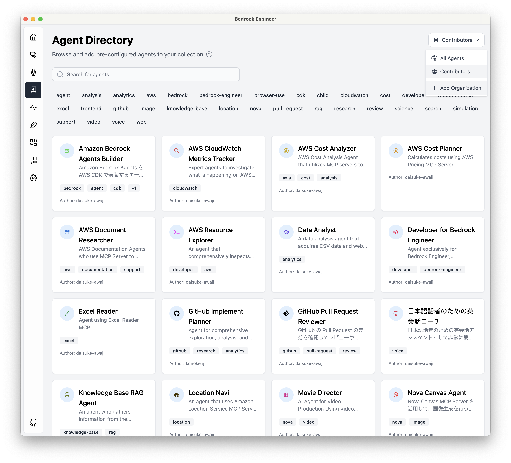
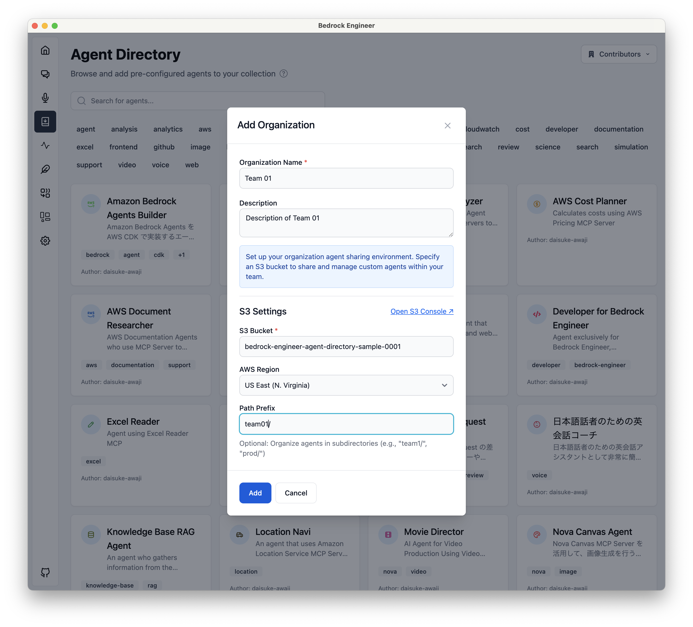
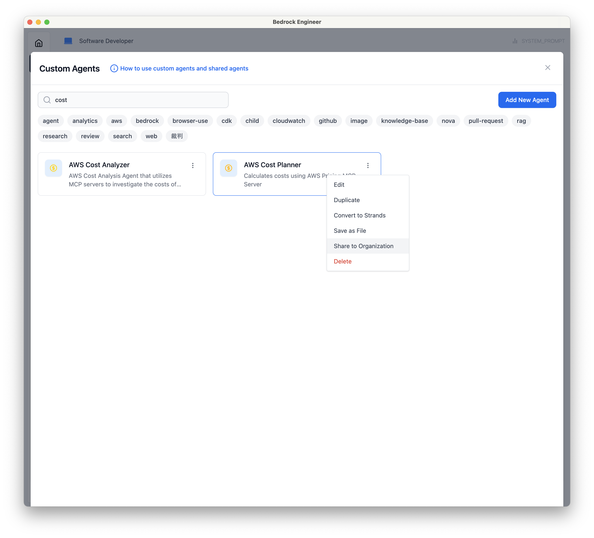
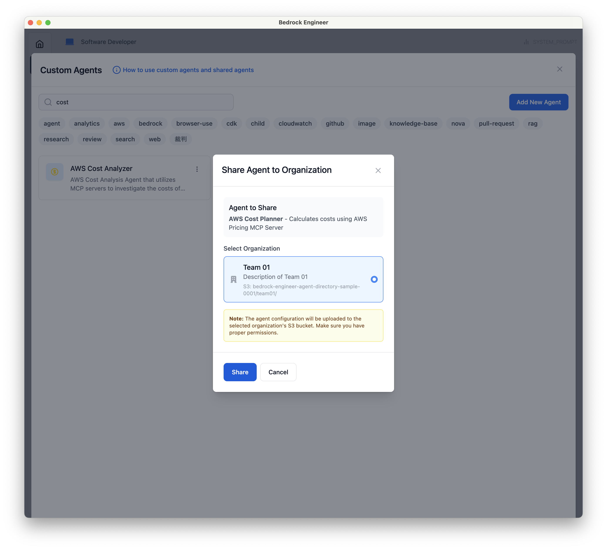
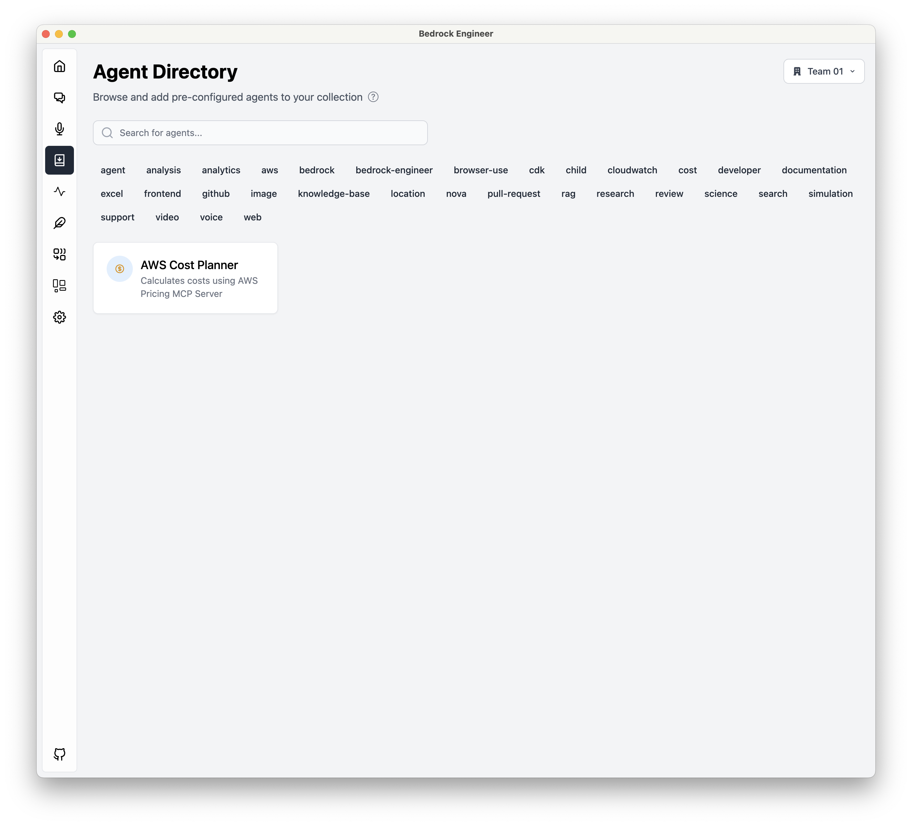
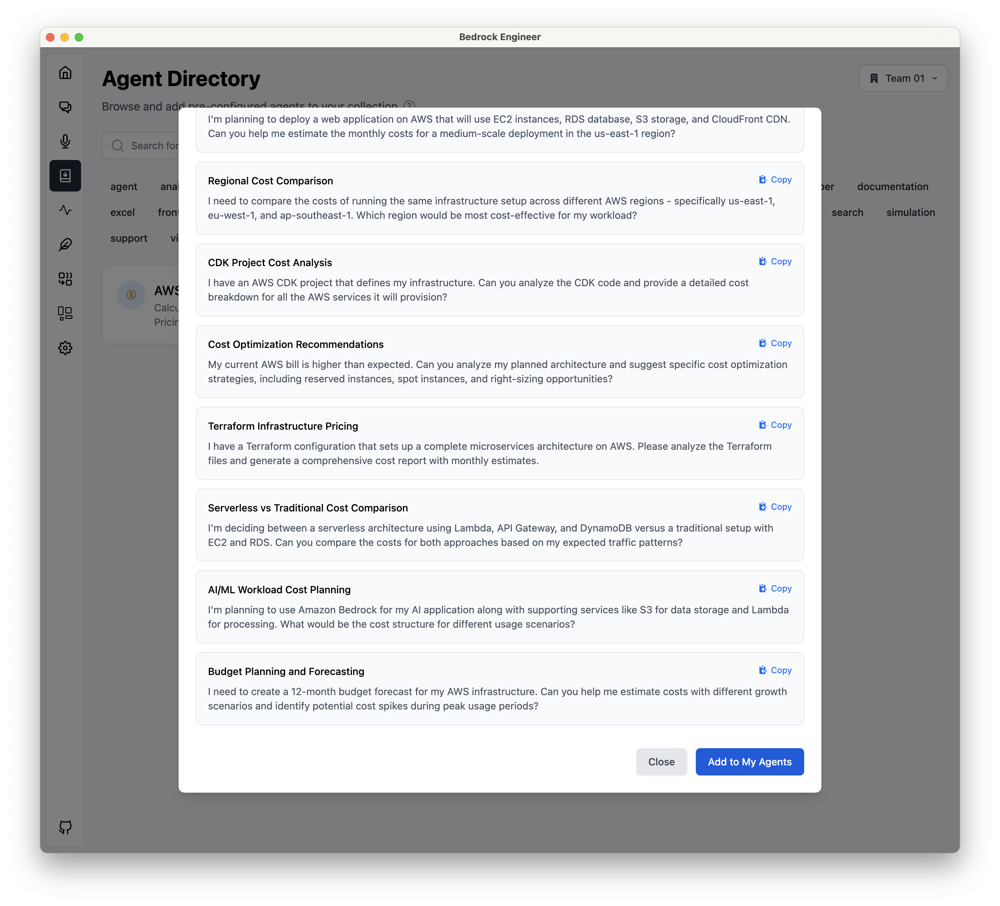

# AgentDirectory 組織共有機能

## 概要

AgentDirectoryの組織共有機能を使用することで、チーム内でエージェントを共有できます。Amazon S3バケットを利用して、組織単位でエージェントを管理・配布します。

## 基本的な使い方

### ステップ1: 組織の作成

1. AgentDirectoryページの右上にある組織セレクターを確認します


2. 組織セレクターをクリックし、「組織を追加」を選択します



3. 組織情報とS3設定を入力します
   - **組織名**: チームまたはプロジェクト名
   - **説明**: 組織の用途（オプション）
   - **S3バケット**: エージェントファイルを保存するS3バケット名
   - **AWSリージョン**: S3バケットのリージョン
   - **パスプレフィックス**: S3内でのパス（オプション、例: `agents/`）



### ステップ2: 組織の Agent Directroy に自分のカスタムエージェントを登録する

1. Chat Page のエージェント設定モーダルを開き、エージェントの３点リーダーをクリックします。「組織で共有する」を選択します。



2. 共有する組織を選択して、「共有」をクリックします。



### ステップ3: 組織エージェントの利用

1. 組織のエージェントをクリックして詳細を確認します



2. 「マイエージェントに追加」ボタンをクリックして、自分のエージェントとして利用できるようにします



## 事前準備

組織共有機能を利用するには、以下の準備が必要です：

### 1. S3バケットの作成

組織のエージェントファイルを保存するためのS3バケットを作成してください。

### 2. AWS認証情報の設定

アプリケーションでAWSにアクセスするための認証情報を設定してください。

### 3. IAMポリシーの設定

組織メンバーが組織共有機能を利用するには、以下のS3権限が必要です：

#### 最小権限のIAMポリシー例

```json
{
  "Version": "2012-10-17",
  "Statement": [
    {
      "Effect": "Allow",
      "Action": ["s3:ListBucket"],
      "Resource": ["arn:aws:s3:::your-organization-bucket"]
    },
    {
      "Effect": "Allow",
      "Action": ["s3:GetObject", "s3:PutObject"],
      "Resource": ["arn:aws:s3:::your-organization-bucket/*"]
    }
  ]
}
```

#### 必要な権限の説明

- **s3:ListBucket**: 組織バケット内のエージェントファイル一覧を取得
- **s3:GetObject**: 組織の共有エージェントファイルを読み取り
- **s3:PutObject**: 自分のカスタムエージェントを組織に共有

#### 権限レベル別の設定

**読み取り専用メンバー**（共有エージェントの利用のみ）:

```json
{
  "Version": "2012-10-17",
  "Statement": [
    {
      "Effect": "Allow",
      "Action": ["s3:ListBucket", "s3:GetObject"],
      "Resource": [
        "arn:aws:s3:::your-organization-bucket",
        "arn:aws:s3:::your-organization-bucket/*"
      ]
    }
  ]
}
```

**共有権限付きメンバー**（エージェントの共有も可能）:

```json
{
  "Version": "2012-10-17",
  "Statement": [
    {
      "Effect": "Allow",
      "Action": ["s3:ListBucket", "s3:GetObject", "s3:PutObject"],
      "Resource": [
        "arn:aws:s3:::your-organization-bucket",
        "arn:aws:s3:::your-organization-bucket/*"
      ]
    }
  ]
}
```

### 4. セキュリティ考慮事項

- **バケットの暗号化**: S3バケットでサーバーサイド暗号化を有効にすることを推奨
- **アクセスログ**: 必要に応じてS3アクセスログを有効化
- **バージョニング**: 誤削除への対策としてS3バージョニングの有効化を検討

詳細なAWS設定については、アプリケーションの設定ガイドを参照してください。

## よくある問題

### 組織が表示されない

- AWS認証情報が正しく設定されているか確認してください
- 指定したS3バケットにアクセス権限があるか確認してください

### エージェントが読み込まれない

- S3バケット名とパスプレフィックスが正しく設定されているか確認してください
- S3バケット内にエージェント定義ファイル（JSON形式）が配置されているか確認してください
- ネットワーク接続とAWSリージョンの設定を確認してください

### 組織の削除

組織を削除すると、その組織の共有エージェントにアクセスできなくなります。削除前に重要なエージェントをマイエージェントに追加しておくことをお勧めします。
